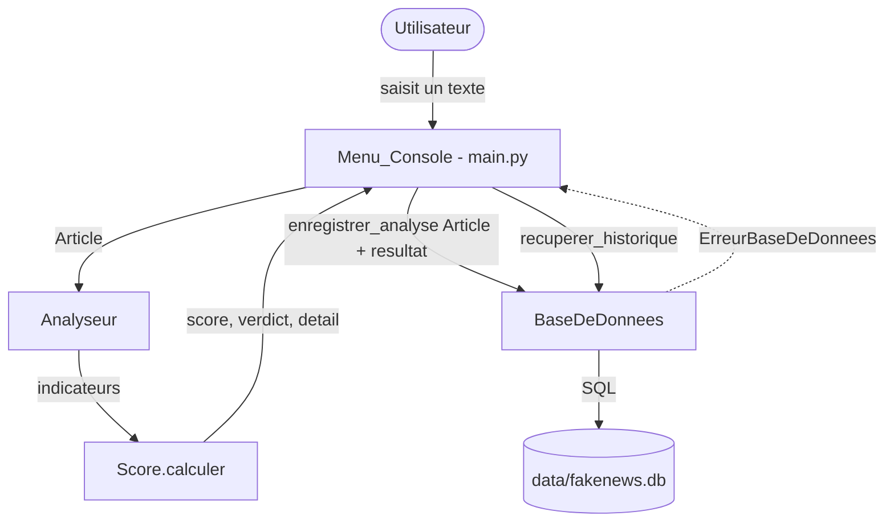
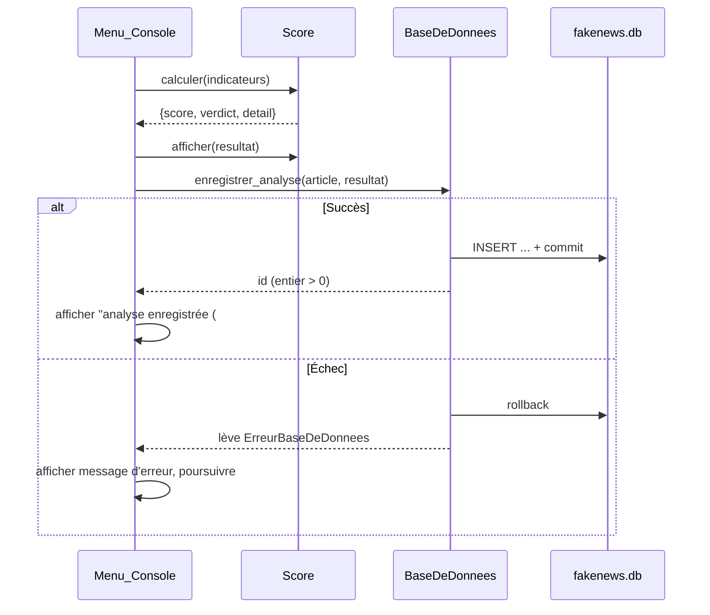
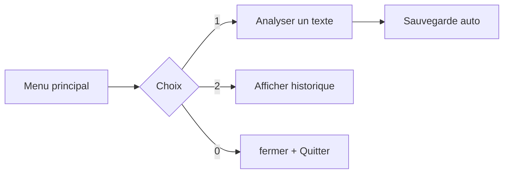
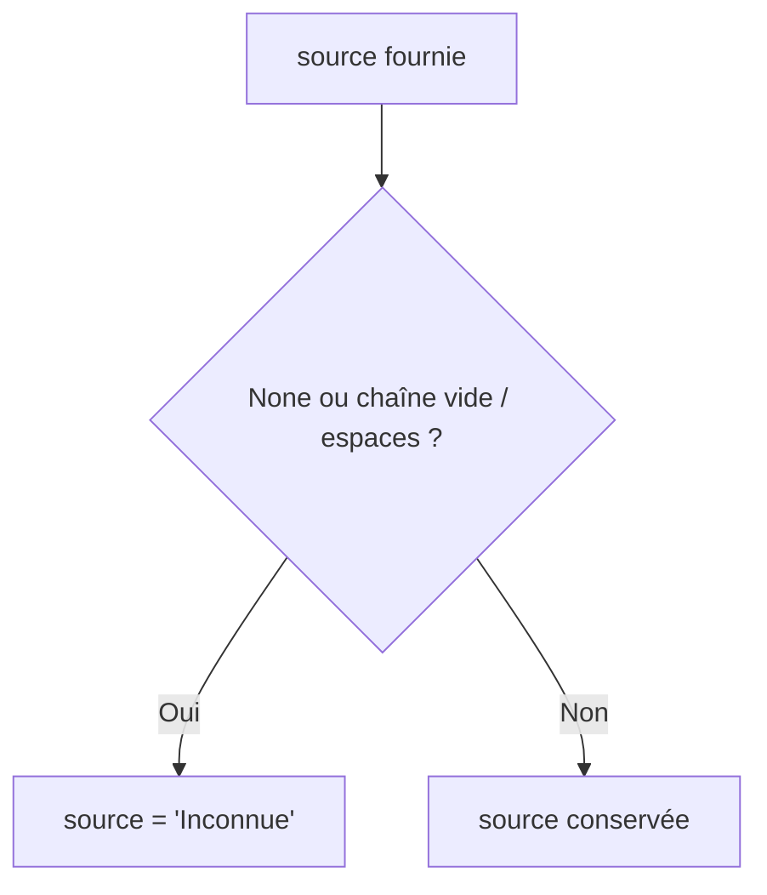

# Design Document — Database Persistence

## Overview

Cette fonctionnalité ajoute une **couche de persistance locale** au projet FakeNewsDetector.
Elle repose sur une nouvelle classe `BaseDeDonnees` (fichier `classes/base_donnees.py`) qui
encapsule toutes les interactions avec une base **SQLite** (module `sqlite3` de la bibliothèque
standard, sans serveur ni dépendance externe). Le fichier de base est stocké localement à
`data/fakenews.db`.

La classe a quatre responsabilités principales :

1. **Initialiser** la base et son schéma au démarrage (création automatique du dossier `data`,
   du fichier de base et des deux tables si elles n'existent pas).
2. **Enregistrer** chaque analyse (article + score + verdict + détail) de façon transactionnelle.
3. **Consulter** l'historique des analyses, trié par date décroissante.
4. **Préparer** une table de référence d'articles fiables (`contenus_fiables`) avec une méthode
   « stub » documentée pour un usage futur de similarité.

L'intégration au menu console (`main.py`) ajoute deux comportements : une **sauvegarde
automatique** après chaque analyse et une nouvelle **option d'historique**.

Le projet étant pédagogique (ENSIAS, 1ère année), la conception privilégie la **simplicité, la
lisibilité et un commentaire abondant en français**, dans la continuité des classes existantes
(`Article`, `Analyseur`, `Score`).

### Décisions de conception et justifications

- **SQLite via `sqlite3`** : intégré à Python, aucun serveur à installer, un seul fichier sur
  disque. Idéal pour un projet local et pédagogique. (Référence : documentation officielle
  Python [`sqlite3`](https://docs.python.org/3/library/sqlite3.html)). *Contenu reformulé pour
  conformité avec les restrictions de licence.*
- **Une connexion unique par instance** : la classe ouvre une connexion dans `__init__` et la
  réutilise. Simple à comprendre et suffisant pour une application console mono-utilisateur.
- **Transactions explicites** : chaque écriture est suivie d'un `commit()` en cas de succès et
  d'un `rollback()` en cas d'erreur, garantissant qu'aucune ligne partielle ne subsiste.
- **Exception métier dédiée** (`ErreurBaseDeDonnees`) : permet de signaler clairement les échecs
  à l'appelant (le menu console) sans exposer directement les détails de `sqlite3`, tout en
  incluant l'opération concernée et la nature de l'erreur.
- **Le détail (liste de lignes) est stocké en texte** : les lignes produites par `Score` sont
  jointes par des sauts de ligne (`\n`) pour tenir dans une seule colonne `TEXT`, et restent
  lisibles à la relecture.

## Architecture

La `BaseDeDonnees` s'insère entre le menu console et le fichier SQLite. Elle ne connaît ni
l'`Analyseur` ni la logique de `Score` : elle reçoit un `Article` et un dictionnaire de
résultat déjà calculé.



### Flux d'enregistrement automatique



### Cycle de vie de la connexion

- `__init__` : crée le dossier `data` si absent, ouvre la connexion, crée le schéma.
- Opérations : `enregistrer_analyse`, `recuperer_historique`, `ajouter_contenu_fiable`,
  `recuperer_contenus_fiables`.
- `fermer()` : ferme la connexion SQLite active.

## Components and Interfaces

### Classe `BaseDeDonnees` (`classes/base_donnees.py`)

```python
class BaseDeDonnees:
    def __init__(self, chemin="data/fakenews.db"):
        """Ouvre (ou crée) la base et garantit l'existence du schéma.

        - Crée le dossier `data` si nécessaire.
        - Établit la connexion SQLite vers `chemin`.
        - Crée les tables `analyses` et `contenus_fiables` si absentes.
        - Lève ErreurBaseDeDonnees en cas d'échec (connexion, dossier, schéma).
        """

    def _creer_schema(self):
        """Crée les deux tables si elles n'existent pas (CREATE TABLE IF NOT EXISTS).
        Transactionnel : rollback si la création échoue."""

    def enregistrer_analyse(self, article, resultat):
        """Insère une analyse (article + resultat de scoring) dans `analyses`.

        Paramètres
        ----------
        article  : Article  -> titre, contenu, source, date
        resultat : dict      -> {"score": int, "verdict": str, "detail": list[str]}

        Retour : int (identifiant de la ligne créée, strictement positif).
        Effets : commit en cas de succès, rollback + ErreurBaseDeDonnees en cas d'échec.
        """

    def recuperer_historique(self, limite=None):
        """Retourne les analyses triées par date DESC puis id DESC.

        - limite=None   -> toutes les analyses.
        - limite >= 1   -> au plus `limite` analyses.
        - limite < 1    -> lève ErreurBaseDeDonnees, aucune analyse retournée.

        Retour : liste de dict {id, titre, score, verdict, date}.
        """

    def ajouter_contenu_fiable(self, titre, contenu, source=None):
        """Ajoute un article de référence dans `contenus_fiables`.

        NOTE : l'exploitation par similarité est prévue pour une phase ultérieure.
        Retour : int (identifiant créé). commit en cas de succès, rollback sinon.
        """

    def recuperer_contenus_fiables(self):
        """Retourne tous les contenus fiables : liste de dict {id, titre, contenu, source}.
        Liste vide si aucun contenu enregistré."""

    def fermer(self):
        """Ferme la connexion SQLite active."""
```

### Exception métier

```python
class ErreurBaseDeDonnees(Exception):
    """Erreur explicite signalée à l'appelant.
    Le message identifie l'opération concernée et la nature de l'erreur SQLite."""
```

### Intégration dans `main.py` (Menu_Console)

- **Initialisation** : créer une instance `BaseDeDonnees()` au démarrage de `main()`.
  En cas d'`ErreurBaseDeDonnees`, afficher un avertissement et continuer sans persistance
  (l'analyse reste utilisable).
- **Sauvegarde automatique** : à la fin de `analyser_texte`, après l'affichage du résultat,
  appeler `enregistrer_analyse(article, resultat)`.
  - Succès → message de confirmation avec l'identifiant.
  - Échec → message d'erreur lisible, poursuite du programme, résultat toujours affiché.
- **Nouvelle option de menu** : « 2. Afficher l'historique » qui appelle
  `recuperer_historique()` et affiche chaque ligne (titre, score, verdict, date).
  - Historique vide → message dédié.
  - Erreur de récupération → message lisible, poursuite du programme.
- **Fermeture** : appeler `fermer()` avant de quitter (choix « 0 »).



## Data Models

### Table `analyses`

| Colonne   | Type SQLite | Contraintes                          | Description                                    |
|-----------|-------------|--------------------------------------|------------------------------------------------|
| `id`      | INTEGER     | PRIMARY KEY AUTOINCREMENT            | Identifiant unique (entier strictement positif)|
| `titre`   | TEXT        | NOT NULL                            | Titre de l'article                             |
| `contenu` | TEXT        | NOT NULL                            | Texte complet analysé                          |
| `source`  | TEXT        | NOT NULL DEFAULT 'Inconnue'         | Source (ou `Inconnue` si absente/vide)         |
| `date`    | TEXT        | NOT NULL                            | Format `AAAA-MM-JJ HH:MM:SS`                   |
| `score`   | INTEGER     | NOT NULL                            | Score de 0 à 100                               |
| `verdict` | TEXT        | NOT NULL                            | `FAKE`, `DOUTEUX` ou `FIABLE`                  |
| `detail`  | TEXT        |                                     | Lignes d'explication jointes par `\n`          |

```sql
CREATE TABLE IF NOT EXISTS analyses (
    id      INTEGER PRIMARY KEY AUTOINCREMENT,
    titre   TEXT    NOT NULL,
    contenu TEXT    NOT NULL,
    source  TEXT    NOT NULL DEFAULT 'Inconnue',
    date    TEXT    NOT NULL,
    score   INTEGER NOT NULL,
    verdict TEXT    NOT NULL,
    detail  TEXT
);
```

### Table `contenus_fiables` (Base_De_Reference)

| Colonne   | Type SQLite | Contraintes                    | Description                          |
|-----------|-------------|--------------------------------|--------------------------------------|
| `id`      | INTEGER     | PRIMARY KEY AUTOINCREMENT      | Identifiant unique                   |
| `titre`   | TEXT        | NOT NULL                       | Titre du contenu fiable              |
| `contenu` | TEXT        | NOT NULL                       | Texte de référence                   |
| `source`  | TEXT        | NOT NULL DEFAULT 'Inconnue'    | Source (ou `Inconnue` si absente)    |

```sql
CREATE TABLE IF NOT EXISTS contenus_fiables (
    id      INTEGER PRIMARY KEY AUTOINCREMENT,
    titre   TEXT NOT NULL,
    contenu TEXT NOT NULL,
    source  TEXT NOT NULL DEFAULT 'Inconnue'
);
```

### Correspondance avec les objets Python

- **Entrée d'enregistrement** : un `Article` (`article.titre`, `article.contenu`,
  `article.source`, `article.date`) + un `resultat` `{score, verdict, detail}`.
  - La date provient de `article.date` (un `datetime`) formatée en
    `strftime("%Y-%m-%d %H:%M:%S")`, cohérent avec `Article.to_dict()`.
  - `detail` (liste de chaînes produite par `Score`) est sérialisé via `"\n".join(detail)`.
  - `source` vide ou `None` est normalisée en `Inconnue` avant insertion.
- **Sortie d'historique** : liste de dictionnaires `{id, titre, score, verdict, date}`.
- **Sortie contenus fiables** : liste de dictionnaires `{id, titre, contenu, source}`.

### Normalisation de la source



## Correctness Properties

*Une propriété est une caractéristique ou un comportement qui doit rester vrai pour toutes les
exécutions valides d'un système — c'est-à-dire un énoncé formel de ce que le système doit faire.
Les propriétés font le pont entre une spécification lisible par un humain et des garanties de
correction vérifiables par la machine.*

Ces propriétés découlent de l'analyse de testabilité (prework). Les critères de configuration, de
schéma, d'interface utilisateur et les conditions d'erreur simulées sont couverts par des tests
unitaires / d'intégration (voir Testing Strategy) et ne figurent pas ici.

### Property 1: Round-trip de persistance d'une analyse

*For any* ensemble d'analyses (Article + résultat `{score, verdict, detail}`) enregistrées, puis
relues — y compris après fermeture et réouverture de la base sur le même fichier — chaque analyse
récupérée conserve le titre, le score, le verdict et la date qui ont été enregistrés, et aucune
ligne préexistante n'est perdue ni modifiée.

**Validates: Requirements 1.6, 2.1, 2.2, 2.4, 4.2**

### Property 2: Round-trip de sérialisation du détail

*For any* liste de lignes de détail produite pour une analyse, la sérialisation en texte puis la
désérialisation préservent l'intégralité des lignes dans le même ordre.

**Validates: Requirements 2.2**

### Property 3: Format de date canonique

*For any* date d'Article enregistrée, la date stockée puis relue respecte exactement le format
`AAAA-MM-JJ HH:MM:SS` et correspond à la date d'origine formatée.

**Validates: Requirements 2.3**

### Property 4: Identifiant unique et strictement positif

*For any* suite d'analyses enregistrées avec succès, chaque enregistrement retourne un identifiant
entier strictement positif, et tous les identifiants retournés sont distincts.

**Validates: Requirements 2.6**

### Property 5: Normalisation de la source absente

*For any* contenu inséré (analyse ou contenu fiable), si la source fournie est nulle ou composée
uniquement d'espaces, la source stockée vaut `Inconnue` ; sinon la source stockée est égale à la
source fournie.

**Validates: Requirements 2.7, 5.6**

### Property 6: Ordre de l'historique

*For any* ensemble d'analyses enregistrées (dates éventuellement identiques), l'historique retourné
est trié par date décroissante, et à dates égales par identifiant décroissant.

**Validates: Requirements 4.1**

### Property 7: Limite de l'historique

*For any* ensemble de N analyses enregistrées et toute limite `L`, l'historique retourné contient
exactement `min(L, N)` analyses lorsque `L >= 1`, et contient les N analyses lorsqu'aucune limite
n'est fournie ; les analyses retournées sont toujours les plus récentes selon l'ordre défini.

**Validates: Requirements 4.5, 4.6**

### Property 8: Erreur sur limite invalide

*For any* limite strictement inférieure à 1, la récupération de l'historique signale une erreur et
ne retourne aucune analyse.

**Validates: Requirements 4.7**

### Property 9: Round-trip de la base de référence

*For any* ensemble de contenus fiables ajoutés, leur récupération retourne pour chacun un
identifiant, le titre, le contenu et la source enregistrés ; lorsqu'aucun contenu n'a été ajouté,
la récupération retourne une collection vide.

**Validates: Requirements 5.1, 5.2, 5.5, 5.7**

## Error Handling

La gestion des erreurs repose sur une exception métier unique `ErreurBaseDeDonnees`, levée par la
`BaseDeDonnees` et interceptée par le menu console.

### Principes

- **Encapsulation** : les erreurs `sqlite3.Error` (et sous-classes comme
  `sqlite3.OperationalError` pour un fichier verrouillé) sont capturées et re-signalées sous forme
  d'`ErreurBaseDeDonnees`, avec un message qui identifie l'opération concernée et la nature de
  l'erreur SQLite. *(Requirements 6.1, 6.2)*
- **Atomicité** : toute opération d'écriture s'exécute dans un bloc `try/except`. En cas de succès
  → `commit()` ; en cas d'erreur → `rollback()` puis levée d'`ErreurBaseDeDonnees`. Aucune ligne
  partielle ne subsiste. *(Requirements 1.7, 2.5, 6.3)*
- **Récupérabilité** : un fichier verrouillé est signalé comme erreur récupérable, sans arrêter le
  processus ; l'appelant peut réessayer ou continuer. *(Requirement 6.2)*
- **Préparation du système de fichiers** : avant d'ouvrir la connexion, le dossier `data` est créé
  s'il n'existe pas (`os.makedirs(..., exist_ok=True)`). Un échec de création est signalé par
  `ErreurBaseDeDonnees`. *(Requirements 6.5, 6.7)*
- **Fermeture** : `fermer()` ferme la connexion active de façon sûre. *(Requirements 6.4, 6.6)*

### Tableau des cas d'erreur

| Situation                                  | Comportement BaseDeDonnees                          | Comportement Menu_Console                    |
|--------------------------------------------|-----------------------------------------------------|----------------------------------------------|
| Connexion impossible (init)                | Lève `ErreurBaseDeDonnees`                           | Avertit, continue sans persistance           |
| Dossier `data` non créable                 | Lève `ErreurBaseDeDonnees`                           | Avertit, continue sans persistance           |
| Échec création schéma                      | rollback, lève `ErreurBaseDeDonnees`                | Avertit, continue sans persistance           |
| Échec d'un enregistrement                  | rollback, aucune ligne résiduelle, lève l'erreur    | Message « sauvegarde échouée », continue     |
| Fichier verrouillé en écriture             | Erreur récupérable, pas d'arrêt du processus        | Message lisible, continue                    |
| Échec récupération historique              | Lève `ErreurBaseDeDonnees`                           | Message lisible, continue                    |
| Limite < 1                                 | Lève `ErreurBaseDeDonnees`, aucune analyse           | Message lisible, continue                    |
| Échec d'affichage de confirmation          | —                                                   | Continue sans afficher la confirmation       |

## Testing Strategy

La stratégie combine **tests basés sur les propriétés** (PBT), **tests unitaires par l'exemple** et
**tests de configuration/intégration légers**. Le module `sqlite3` permet d'utiliser une base
**temporaire** (fichier dans un dossier temporaire) ou **en mémoire** (`:memory:`), ce qui rend
l'exécution de 100+ itérations rapide et sans effet de bord.

### Bibliothèque de test

- **Langage** : Python (cohérent avec le projet).
- **Tests par l'exemple** : `pytest` (ou `unittest` de la bibliothèque standard si l'on veut éviter
  toute dépendance).
- **Tests basés sur les propriétés** : **Hypothesis**. On ne réimplémente pas le moteur PBT.

### Tests basés sur les propriétés

- Chaque propriété de la section *Correctness Properties* est implémentée par **un seul** test
  basé sur les propriétés.
- **Minimum 100 itérations** par test de propriété (`@settings(max_examples=100)` sous Hypothesis).
- Chaque test porte un commentaire de traçabilité au format :
  **Feature: database-persistence, Property {numéro}: {texte de la propriété}**
- Générateurs (stratégies Hypothesis) :
  - **Articles** : titres et contenus de texte arbitraires (incluant unicode, espaces,
    chaînes longues), sources parmi `None`, chaîne vide, espaces, ou texte ; dates `datetime`
    variées (couvre Requirements 2.3, 2.7, et les cas limites unicode/longueur).
  - **Résultats** : `score` entier 0–100, `verdict` parmi `FAKE`/`DOUTEUX`/`FIABLE`, `detail`
    liste de lignes arbitraires (couvre 2.2).
  - **Limites** : entiers couvrant `< 1`, `1..N`, et `> N` (couvre 4.5–4.7).
  - **Ensembles d'analyses** : listes de taille variable, dates avec doublons pour tester les
    départages d'ordre (couvre 4.1).
- Isolation : chaque exemple utilise une base temporaire neuve afin que les itérations soient
  indépendantes.

### Tests unitaires par l'exemple et edge cases

Couvrent les critères classés EXAMPLE / EDGE_CASE / SMOKE dans le prework :

- **Configuration / schéma (SMOKE)** : connexion établie (1.1), fichier créé (1.2), tables
  `analyses` (1.3) et `contenus_fiables` (1.4) présentes, colonnes attendues via
  `PRAGMA table_info` (1.5, 5.3), présence de `fermer()` (6.4), docstring mentionnant l'usage futur
  de similarité (5.4).
- **Système de fichiers (EXAMPLE)** : création du dossier `data` manquant (6.5), fermeture effective
  de la connexion (6.6).
- **Conditions d'erreur (EDGE_CASE)** : échec de schéma avec rollback (1.7), connexion impossible
  (1.8), échec d'enregistrement sans ligne résiduelle ni id (2.5, 2.8, 6.3), message d'erreur SQLite
  identifiant l'opération (6.1), fichier verrouillé récupérable (6.2), échec de création du dossier
  (6.7). Ces échecs sont simulés (chemin invalide, base corrompue, mock du curseur, ou seconde
  connexion verrouillante).
- **Intégration menu console (EXAMPLE)** : transmission automatique de l'analyse (3.1), message de
  confirmation (3.2), poursuite si l'affichage échoue (3.3), message d'erreur de sauvegarde (3.4),
  poursuite et conservation du résultat affiché (3.5), rendu de l'historique (4.3), message
  d'historique vide (4.4), message lisible si récupération échoue (4.8).

### Équilibre

Les tests de propriétés couvrent la correction générale (round-trips, invariants d'ordre,
normalisation, limites). Les tests par l'exemple se concentrent sur les points d'intégration avec
`main.py`, la configuration du schéma et les conditions d'erreur difficiles à générer
aléatoirement. On évite de multiplier les tests unitaires là où une propriété couvre déjà l'espace
d'entrée.
